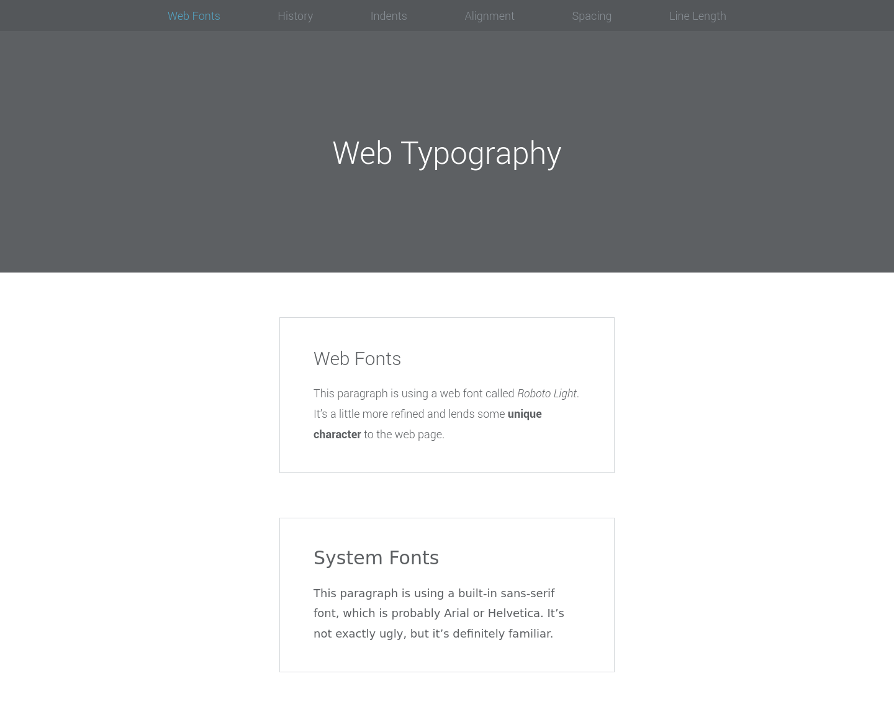
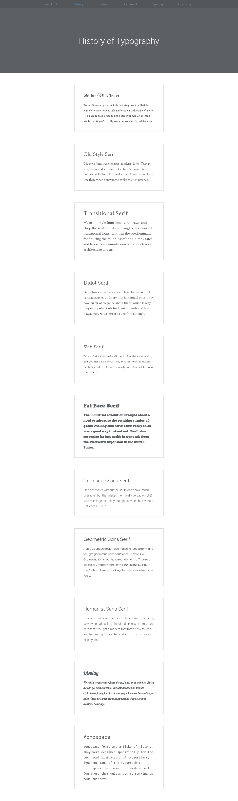
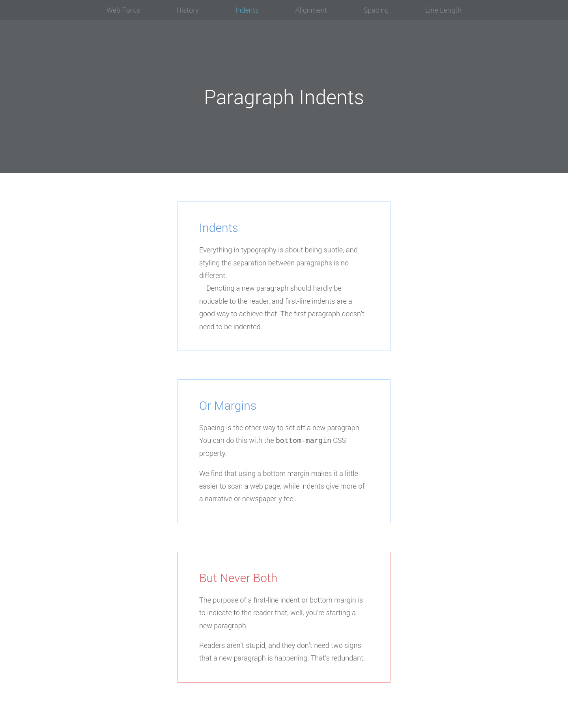
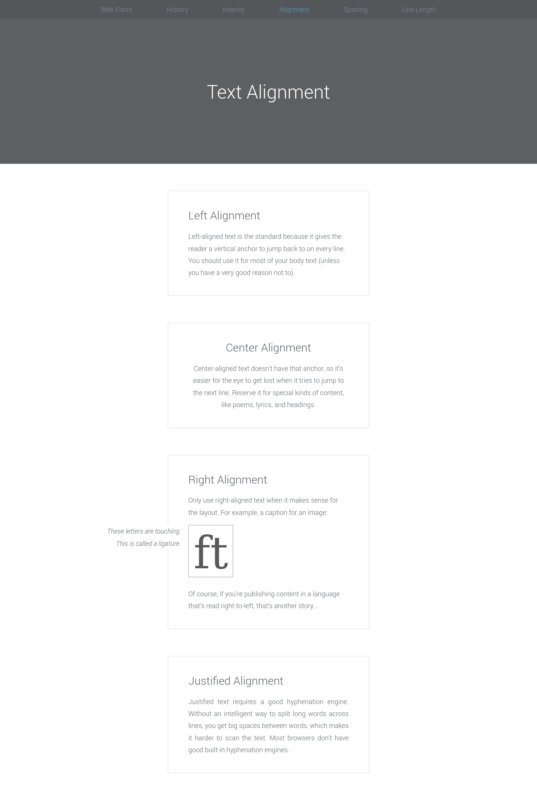
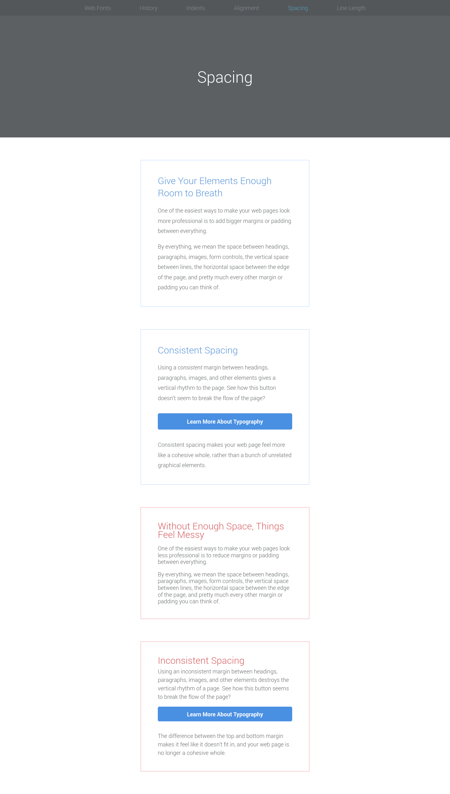
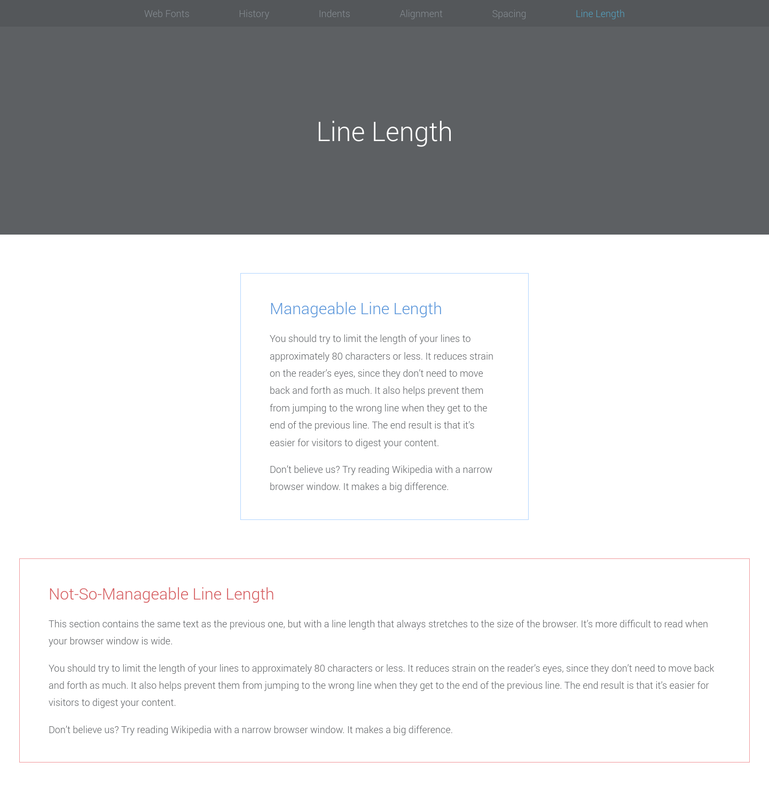

# Interneting Is Hard - Web Typography

This is a solution to the [Web Typography tutorial No. 14 of HTML & CSS Is Hard](https://www.internetingishard.com/html-and-css/web-typography/).

## Table of contents

- [Overview](#overview)
  - [Screenshots](#screenshots)
  - [Links](#links)
- [My process](#my-process)
  - [Built with](#built-with)
  - [What I learned](#what-i-learned)
  - [Continued development](#continued-development)
  - [Useful resources](#useful-resources)
- [Author](#author)
- [Acknowledgments](#acknowledgments)

## Overview

### Screenshots








### Links

- Solution URL: [Web Typography solution](https://github.com/jugglingdev/web-typography)
- Live Site URL: [Web Typography live site](https://jugglingdev.github.io/web-typography/)

## My process

### Built with

- Semantic HTML5 markup
- CSS custom properties

### What I learned

This tutorial started with a brief history of web fonts, which was helpful.  The web went from roughly a dozen web safe fonts to custom web fonts with 4 different file formats (.svg, .eot, .ttf, and .woff) to standardized .woff and .woff2 fonts.

Next, this tutorial covered the two ways to add web fonts to a site:  locally or externally.

For a locally hosted web font, you download a web font from a site like [Font Squirrel](https://www.fontsquirrel.com/) and add it to your project.  Then, you embed the font at the top of your stylesheet as in this code:

```css
@font-face {
  font-family: "Roboto"
  src: url("Roboto-Light-webfont.woff") format("woff");
}
```
Now that the font is embedded, you can apply it to your site in the stylesheet!

When working with fonts, it's important to remember:
* Font families are made up of multiple font faces
* Font faces have are categorized by weight and style
* Weight has a spectrum of 100 to 900 (thin, extra light, light, regular, medium, semi bold, bold, extra bold, and black)
* Style includes roman, italic, condensed, and condensed italic
* When using `@font-face` rules, show the relationship between font faces by labeling the `font-family` the broad family name and then specifying the `font-style` and `font-weight` for each face under its at-rule 

```css
/* This makes your CSS more intuitive than changing the font-family value for related faces */

@font-face {
  font-family: "Roboto";
  src: url("Roboto-Light-webfont.woff") format("woff");
  font-style: normal;
  font-weight: 300;
}

@font-face {
  font-family: "Roboto";
  src: url("Roboto-LightItalic-webfont.woff") format("woff");
  font-style: italic;
  font-weight: 300;
}

/* ... Then set the default font */

body {
  font-family: "Roboto", sans-serif;
  font-weight: 300;
}

em {
  font-style: italic;
}
```

That's that locally hosted way.  The second way to add web fonts to a site is external.  [Google Fonts](https://fonts.google.com/) takes out the steps of adding .woff files and using `@font-face` rules.  With this method, we add a `<link>` with an `href` to the font URL as a stylesheet in the head of the page's HTML.  This is much more simple, though most professional sites use locally hosted web fonts for more flexibility.

A few other notes include:
* Use `text-align` OR `margin-bottom` for paragraph indents (never both or you will be judged)
* Use the `:first-of-type pseudo-class` to leave off the indention of the first paragraph after a heading
* Use `text-align` to change the default `left` value to `right`, `center`, or `justify` as needed
* Use `line-height` (leading) to set the space between lines of the same paragraph
* Use `max-width` to set the max line length to about 80 characters


### Continued development

The biggest thing I can do to improve my skills is to apply what I've learned about typography to websites I've designed from scratch and start working with a bunch of designers.  Looking forward to it!

### Useful resources

- [Bulletproof @font-face Syntax](https://www.paulirish.com/2009/bulletproof-font-face-implementation-syntax/) - Great resource for @font-face definitions.
- [Font Squirrel](https://www.fontsquirrel.com/) - Free fonts for commerical use.  Big selection with some good fonts to dig for.
- [Google Fonts](https://fonts.google.com/) - Another resource for good quality free fonts.
- [Fontspring](https://www.fontspring.com/) - For projects with a bigger budget, Fontspring is worth looking at.  Huge selection of excellent fonts.
- [Practical Typography](https://practicaltypography.com/summary-of-key-rules.html) - Summary of key rules of typography.

## Author

- GitHub - [@jugglingdev](https://github.com/jugglingdev)

- freeCodeCamp - [@jugglingdev](https://www.freecodecamp.org/jugglingdev)

- Frontend Mentor - [@jugglingdev](https://www.frontendmentor.io/profile/jugglingdev)

- LinkedIn - [Kayla Paden](https://www.linkedin.com/in/kayla-marie-paden)

## Acknowledgments

Shoutout to Oliver James for his dedication to publishing and maintaining InternetingIsHard.com.  His tutorials were the first that really clicked for me.